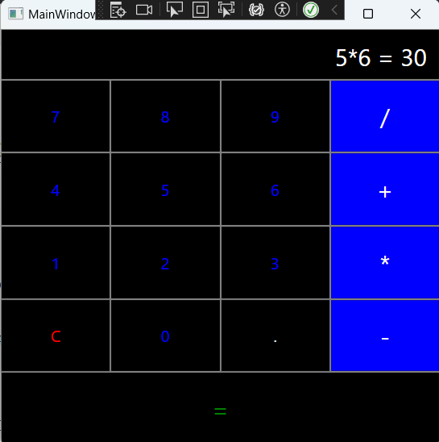

# 🧮 Calculator Application

A simple calculator built using **WPF (Windows Presentation Foundation)** in C# for basic arithmetic operations. The application provides an intuitive user interface for performing calculations with functionalities like addition, subtraction, multiplication, and division, and advanced features like exponentiation and square roots, and operation history navigation.

## 📜 License and Author

- **Author**: [Noura Raoui]  
- **License**: MIT License  
  Feel free to use, modify, and distribute this project under the terms of the MIT License. See the `LICENSE` file for details.  

## 🗂️ Table of Contents

1. [Title and Brief Description](#-calculator-application)  
2. [License and Author](#-license-and-author)  
3. [System Requirements](#-system-requirements)  
4. [Main Features](#-main-features)  
5. [Installation Guide](#-installation-guide)  
6. [Usage Guide](#-usage-guide) 
7. [Examples and Screenshots](#-examples-and-screenshots)  
8. [Conclusions and Reflections](#-conclusions-and-reflections)

## 💻 System Requirements

- **Operating System**: Windows 11 
- **Development Environment**: Visual Studio 2022 
- **.NET Framework**: .NET 8.0

## ✨ Main Features

- Perform basic arithmetic operations: addition, subtraction, multiplication, division.  
- Supports decimal numbers.
- Advanced functions:
  - **Exponentiation (`^`)**: Raise a number to a power.
  - **Square Root (`√`)**: Calculate the square root of a number.
  - **Parentheses (`(` and `)`)**: Group parts of expressions to control the order of operations.  
- **History Navigation**: View and navigate through past calculations using history buttons (up and down arrows).
- **Negative Number Toggle**: Easily toggle the sign of a number during input.
- Displays full calculation history for reference.  
- Error handling for invalid operations (e.g., division by zero).  
- Responsive user interface with a clean design.

## 📝 Installation Guide

1. **Clone the Repository**:  
   ```cmd
   git clone https://github.com/Nraoui/Calculator.git
   cd calculator-app

2. **Open the Solution in Visual Studio**:  
   Open `CalculatorII.sln` in Visual Studio.

3. **Build and Run the Application**:  
   Press `F5` to build and run the application.

---

## 🔧 Usage Guide

1. **Start the Application**:  
   Open the application, and the calculator interface will appear.  

2. **Perform a Calculation**:  
   - Use the numeric buttons to input numbers.  
   - Use the operator buttons (`+`, `-`, `*`, `/`) to perform operations.  
   - Press `=` to calculate the result.  

3. **Advanced Operations**:
   - **Exponentiation**: Use the `^` button to raise a number to a power.
   - **Square Root**: Use the `√` button to calculate the square root of a number.
   - **Parentheses**: Use the `(` and `)` buttons to group expressions for proper calculation order.

5. **Decimal Numbers**:  
   - You can input decimal numbers by pressing the `.` button. The calculator ensures that only one decimal point is included per number.
   
6. **History Navigation**:  
   - Use the **Up** and **Down** arrow buttons to navigate through the operation history.  
   - The history is maintained for the calculations made during the session.

7. **Negative Number Toggle**:  
   - You can toggle the sign of the number you're inputting by using the sign toggle button. This will allow for negative numbers to be entered.

8. **Clear the Display**:  
   Use the `C` button to clear the current operation.  

### Example Steps:
- **Input**: `7 + 3`  
- **Output**: `7 + 3 = 10`  

- **Input**: `2 ^ 3`  
- **Output**: `2 ^ 3 = 8`

- **Input**: `√9`  
- **Output**: `√9 = 3`

- **Input**: `5.5 + 3.2`  
- **Output**: `5.5 + 3.2 = 8.7`

5. **Error Handling**:  
   - If you try to divide by zero, the application will display:  
     `Cannot divide by zero`.  
   - If you attempt invalid input, such as missing an operand or chaining two operators, the application will display:  
     `Error`.  
     - Example 1: `5 + =`  
     - Example 2: `5 * / 5` 
   - If you try to calculate the square root of a negative number, the application will display:  
     `Cannot calculate square root of a negative number`.
     - Example 3: `√-9`
   - If there are unmatched parentheses, the application will display:  
     `Unmatched parentheses`.
     - Example 4: `(5 + 3`
     - Example 5: `5 + (3 * 2`

---

## 📸 Examples and Screenshots

### Example Screenshot:  
  

### Sample Calculation:  
- **Input**: `5 * 6`  
- **Output**: `5 * 6 = 30`  


---

## 🤔 Conclusions and Reflections

This project helped reinforce foundational concepts in C# and WPF application development. Implementing features like input validation, dynamic UI updates, and error handling provided a deeper understanding of user-centric design. Future improvements may include:

- Implementing scientific calculator functionalities.   
- Enhancing performance for complex calculations. 

### Key Learnings:
- **WPF Framework**: I gained hands-on experience with WPF (Windows Presentation Foundation), learning how to design intuitive user interfaces using XAML and connect them with C# backend logic. 
  
- **Error Handling**: I focused on implementing proper error handling, ensuring that the calculator displays clear messages for invalid operations (e.g., division by zero, invalid syntax, etc.). Handling edge cases such as square roots of negative numbers or unmatched parentheses was a valuable learning experience for building robust applications.

- **User Experience**: I learned the importance of making the user experience (UX) intuitive, especially in terms of interface layout and button responsiveness. Ensuring that users can easily input values, view results, and perform operations without confusion was a priority.